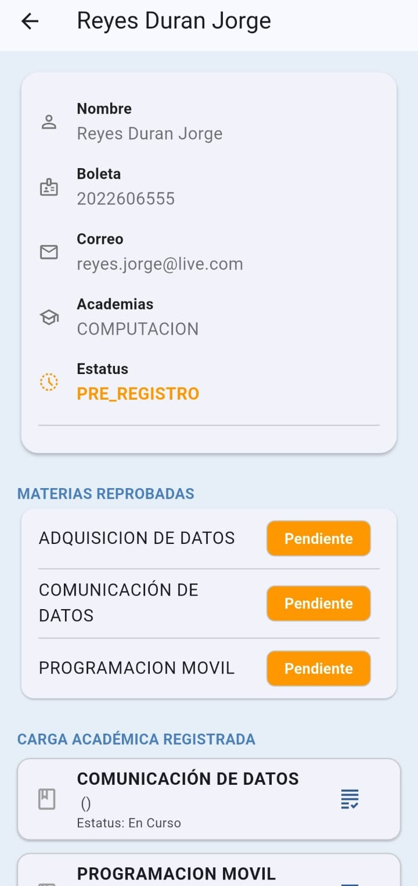

<div style="text-align: center;">
  

  <h1>Sistema de Acompañamiento Tutorial</h1>

  <p>
    <strong>Centralización, Trazabilidad y Gestión Digital para Tutorías de Recuperación en UPIICSA</strong>
  </p>

  <a href="https://github.com/betilloxann/proyecto_tutorias/actions">
    
  </a>
  <a href="https://github.com/betilloxann/proyecto_tutorias/releases">
    
  </a>
  <a href="https://proyecto-tutorias.vercel.app/">
    
  </a>
  <br/>
  <br/>

  

  <br/>
  <br/>

  <a href="https://github.com/betilloxann/proyecto_tutorias/releases/latest/download/app-release.apk">
    
  </a>
  &nbsp;&nbsp;
  <a href="https://betilloxann.github.io/proyecto_tutorias/">
    
  </a>
</div>

<br/>

---

## Acerca del Proyecto

El **Sistema de Acompañamiento Tutorial (SAT)** es una solución multiplataforma (Móvil y Web) desarrollada para optimizar el **Programa Institucional de Tutorías (PIT)**.

El sistema resuelve la problemática de la dispersión de información mediante un expediente digital centralizado, permitiendo:
* **Alumnos:** Subir evidencias fotográficas y consultar su estatus en tiempo real.
* **Tutores/Jefes:** Validar documentos y asignar calificaciones digitalmente.
* **Coordinación:** Generar reportes consolidados para Gestión Escolar.

---

## Galería del Proyecto
|                      Inicio Tutorías                       |                    Gestión de Alumnos                    |                             Gestión del Alumno                             |
|:----------------------------------------------------------:|:--------------------------------------------------------:|:--------------------------------------------------------------------------:|
|  |  |                  |
|               *Inicio del usuario Tutorías*                |           *Dashboard con semáforo de estatus*            | *Perfil que ven Tutorías y Academias para ver estado de alumno específico* |
---

## Stack Tecnológico

Este proyecto implementa una arquitectura moderna y escalable:

| Categoría | Tecnologías |
| :--- | :--- |
| **Frontend Móvil** |  **3.35.5** |
| **Backend (BaaS)** |  (Auth, Firestore, Storage) |
| **CI/CD** |  &  |
| **Documentación** |  |

---

## Instalación Local

Si deseas clonar y ejecutar el proyecto en tu entorno de desarrollo:

1.  **Prerrequisitos:** Flutter SDK 3.35.5, Java 11.
2.  **Clonar:**
    ```bash
    git clone https://github.com/betilloXann/proyecto_tutorias.git
    cd proyecto_tutorias
    ```
3.  **Configuración:**
    * Necesitas el archivo `google-services.json` (Android) y `GoogleService-Info.plist` (iOS).
    * Colócalos en sus carpetas respectivas (`android/app/` y `ios/Runner/`).
4.  **Ejecutar:**
    ```bash
    flutter pub get
    flutter run
    ```
---

<div style="text-align: center;">
  <p>Desarrollado con ❤️ por el equipo de Ingeniería Informática - UPIICSA IPN</p>
</div>