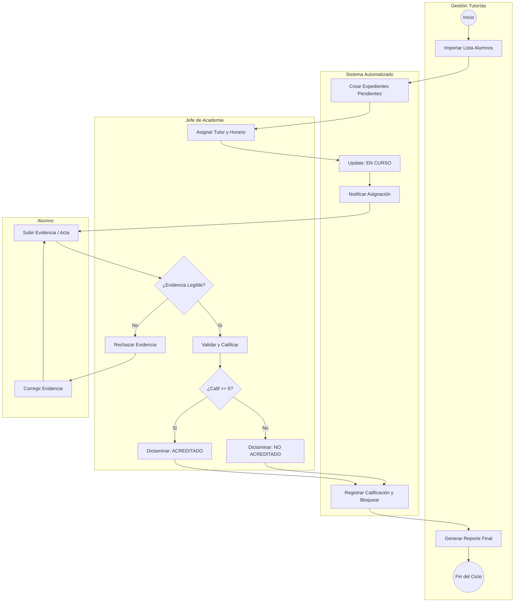

# Arquitectura de Procesos (Workflow)

El sistema automatiza el ciclo de vida completo de la tutoría de recuperación, transformando un proceso manual fragmentado en un **flujo de trabajo digital continuo**.

## Flujo de Trabajo y Automatización
El siguiente diagrama de actividades modela la naturaleza dinámica del sistema, delimitando las responsabilidades mediante carriles (*swimlanes*) para cada actor: **Gestión Escolar**, **Sistema Automatizado**, **Jefe de Academia** y **Alumno**.

### Puntos Clave del Proceso:
* **Inicialización Automática:** El sistema crea los expedientes digitales en estado "Pendiente" tras la importación masiva.
* **Notificaciones en Tiempo Real:** Se eliminan los avisos manuales; el sistema alerta al alumno inmediatamente después de la asignación.
* **Bucle de Corrección:** Si una evidencia es rechazada por ilegible, el flujo regresa al alumno para su corrección, garantizando que solo se procesen expedientes completos.
* **Cierre Seguro:** Al dictaminar la calificación (Acreditado/No Acreditado), el sistema bloquea el registro para preservar la inmutabilidad del dato.

