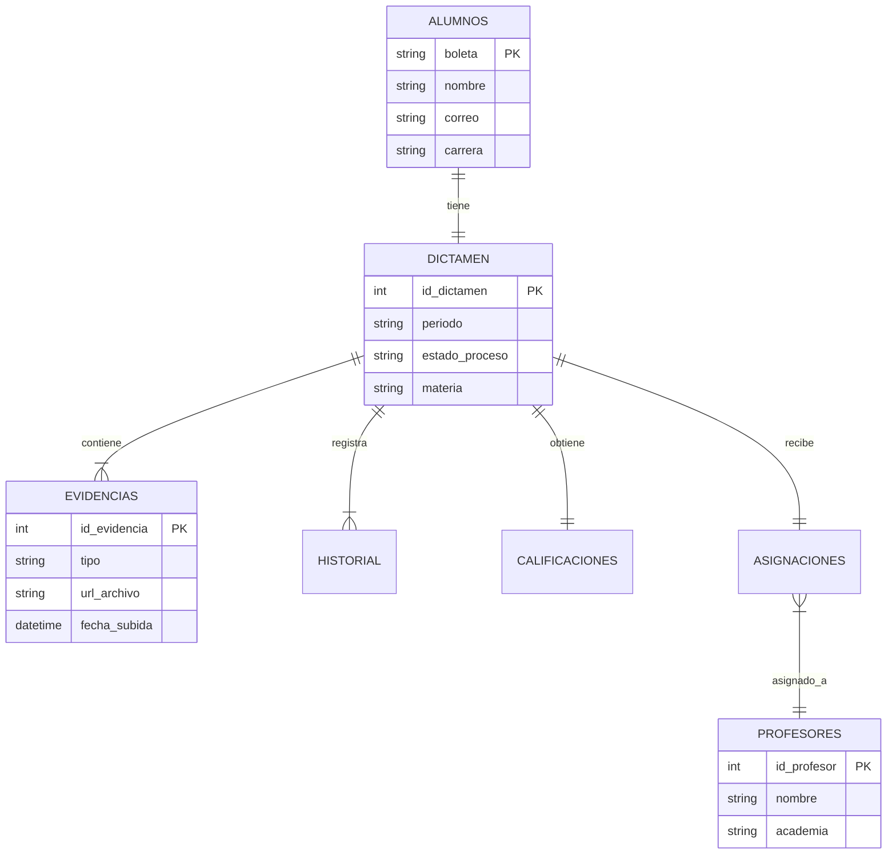

# Arquitectura de Datos y Modelo E-R

El diseño de la base de datos constituye un elemento fundamental para garantizar la **integridad, organización y trazabilidad** de la información del Programa de Tutorías.

## Modelo Entidad-Relación
Para asegurar un almacenamiento estructurado, se ha diseñado un modelo relacional que evita la duplicidad de datos y asegura la consistencia referencial.

Las principales características del modelo son:
1.  **Centralización:** Todas las entidades giran en torno al `Dictamen`, que actúa como el expediente digital único del alumno.
2.  **Trazabilidad:** La entidad `Historial` registra los cambios de estado, permitiendo auditorías futuras.
3.  **Integridad:** Las relaciones (Foreign Keys) aseguran que no existan "asignaciones huérfanas" o evidencias sin un dictamen asociado.

A continuación, se presenta el esquema lógico de las tablas y sus relaciones:

