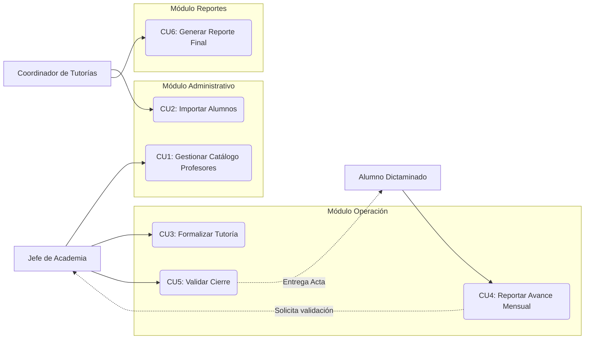

# Actores y Casos de Uso

## Actores del Sistema

### 1. Coordinador de Tutorías (Administrador)
* **Rol:** Máxima autoridad del sistema.
* **Responsabilidades:** Inicializa el ciclo escolar, importa masivamente los alumnos dictaminados y genera los reportes finales consolidados para Gestión Escolar.

### 2. Jefe de Academia (Operativo)
* **Rol:** Gestor principal de la asignación académica.
* **Responsabilidades:** Administra su catálogo de profesores, asigna tutores a los alumnos, valida las evidencias mensuales y registra la calificación final.

### 3. Alumno Dictaminado (Usuario Final)
* **Rol:** Usuario transitorio bajo esquema de autogestión.
* **Responsabilidades:** Consulta su asignación, sube evidencias de asistencia (bitácoras) y entrega digitalmente su acta de calificación.

---

## Casos de Uso Principales

El sistema se divide en tres módulos lógicos de interacción:

### Módulo Administrativo
* **CU1: Gestionar Catálogo de Profesores**
    * *Actor:* Jefe de Academia.
    * *Acción:* Altas, bajas y cambios de profesores disponibles.
* **CU2: Importar Alumnos Dictaminados**
    * *Actor:* Coordinador.
    * *Acción:* Carga masiva (Excel) que crea expedientes en estado `PENDIENTE_ASIGNACION`.

### Módulo de Operación (Core)
* **CU3: Formalizar Tutoría (Asignación)**
    * *Actor:* Jefe de Academia.
    * *Acción:* Vincula Alumno + Tutor + Horario. El estado cambia a `EN_CURSO`.
* **CU4: Reportar Avance Mensual**
    * *Actor:* Alumno.
    * *Flujo:* Sube evidencia -> Jefe revisa.
    * *Alternativa:* Si el Jefe rechaza, el alumno recibe notificación para corregir.
* **CU5: Validar Cierre de Tutoría**
    * *Actor:* Jefe de Academia.
    * *Acción:* Valida el acta final subida por el alumno y registra la calificación (6-10 o NA). Estado final: `ACREDITADO` o `NO_ACREDITADO`.

### Módulo de Reportes
* **CU6: Generar Reporte Final**
    * *Actor:* Coordinador.
    * *Acción:* Descarga del listado oficial filtrado por estatus para entrega a SAES.

---

## Diagramas de Casos de Uso

