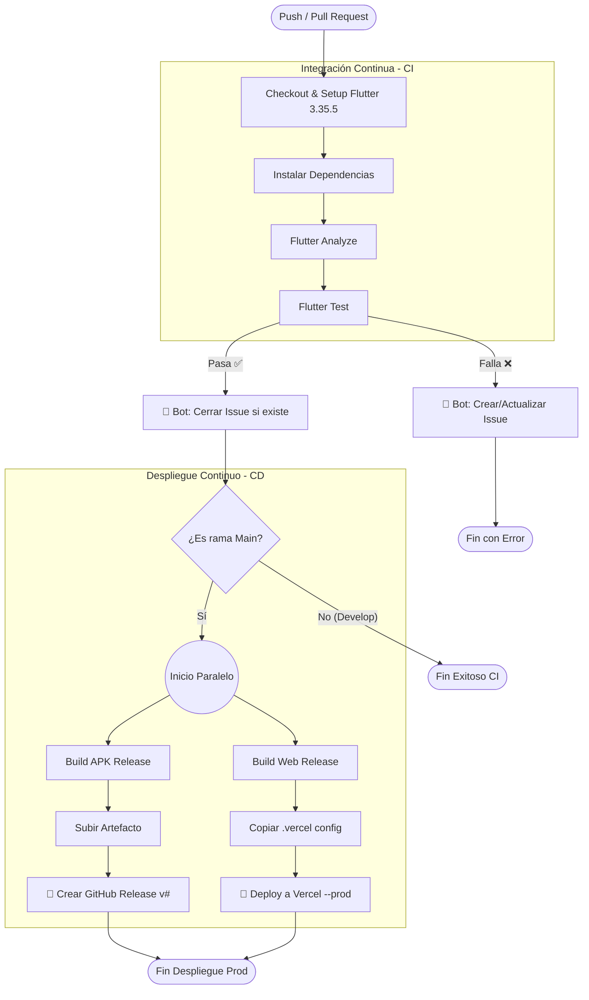

# Integración y Despliegue Continuo (CI/CD)

El proyecto utiliza una estrategia robusta de automatización mediante **GitHub Actions** para la Integración Continua (CI) y **Vercel** para el Despliegue Continuo (CD) de la versión web.

Esta arquitectura asegura que cada cambio en el código sea verificado, probado y, si es válido, desplegado a producción automáticamente.

## Flujo de Trabajo (Pipeline)

Nuestro archivo de configuración `.github/workflows/flutter_ci.yml` orquesta todo el proceso. A continuación, se detalla el diagrama de flujo de la automatización:



## Etapas del Pipeline

### 1. Integración Continua (CI)

Se ejecuta en las ramas **`develop`** y **`main`**.

**Entorno**

* Servidor: `ubuntu-latest`
* Flutter: **3.35.5**

**Calidad de Código**

* `flutter analyze`
  Detecta errores de sintaxis y estilo.
* `flutter test`
  Ejecuta pruebas unitarias de ViewModels y lógica de negocio.

**Gestión Automática de Errores (IssueOps)**

* Si el *build* falla:

    * Un bot crea automáticamente un **Issue en GitHub**
    * Se etiqueta al autor del commit
    * Se adjuntan los logs del error
* Si el *build* se corrige en el siguiente commit:

    * El bot comenta en el Issue
    * El Issue se cierra automáticamente

---

### 2. Despliegue Continuo (CD)

Se ejecuta **exclusivamente** en la rama **`main`**.

#### 📱 Android (GitHub Releases)

* Se genera el archivo **`.apk`** de producción.
* Se crea un **Release en GitHub** etiquetado con el número de ejecución
  *(ej. `v45`)*.
* El instalador se adjunta para descarga directa.

#### 🌐 Web (Vercel)

Se utiliza **Vercel** para el hosting de la versión web administrativa.

**Build**

  ```bash
  flutter build web --release
  ```
**Configuración**

    - Se inyecta la identidad del proyecto
      (`.vercel/project.json`) en la carpeta de compilación
    - Asegura el enlace correcto con la organización
**Despliegue**

    - Se utiliza `amondnet/vercel-action`
    - Se suben los archivos estáticos
    - Se fuerza la actualización de producción

---

## Estrategia de Pruebas

> **Nota:** Los detalles específicos de los tests se encuentran en la sección *Estrategia de Pruebas*.

El proceso de CI asegura la ejecución de:

* **Pruebas Unitarias**

    * `LoginViewModel`
    * `RegisterViewModel`
    * `StudentLookupViewModel`
* **Mocks**

    * Uso de `mockito`
    * Simulación de Firebase durante la integración