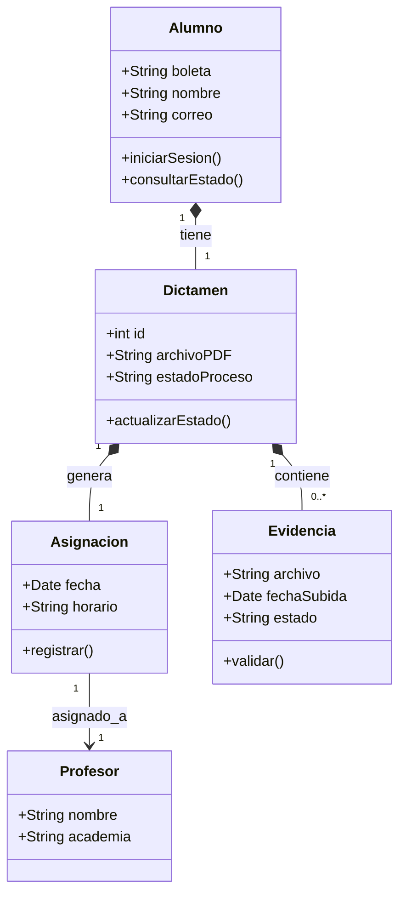
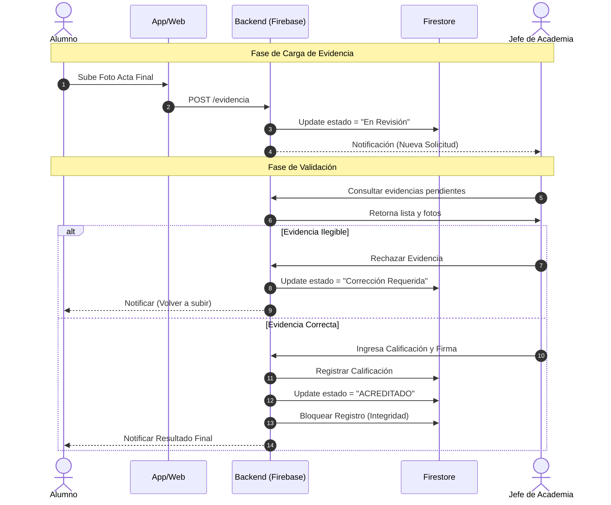

# Modelado UML del Sistema

En esta sección se formaliza el diseño técnico de la solución mediante el **Lenguaje Unificado de Modelado (UML)**. Estos diagramas representan tanto la estructura estática de la información como el comportamiento dinámico de los procesos críticos.

## Diagrama de Clases
El modelo de clases describe los elementos lógicos que conforman el prototipo. Se han definido entidades clave como `Alumno`, `Dictamen` y `Asignación` para modelar el flujo de la información académica.

Este diseño permite visualizar las relaciones fundamentales del sistema:
* Un **Alumno** posee un único Dictamen activo.
* Un **Dictamen** concentra el historial de evidencias y calificaciones.
* La **Asignación** vincula al alumno con un Profesor específico para la tutoría de recuperación.

## Diagrama de Secuencia: Validación de Evidencias
Este diagrama detalla el flujo transaccional para la carga y validación del **Acta de Calificación Final**. Representa la interacción temporal entre el Alumno (quien sube la evidencia), el Sistema (que procesa y notifica) y el Jefe de Academia (quien valida).

El proceso destaca por implementar una lógica de "segregación de funciones": el alumno no puede modificar su estatus por sí mismo, y el Jefe de Academia requiere la evidencia digital para poder asentar la calificación.

